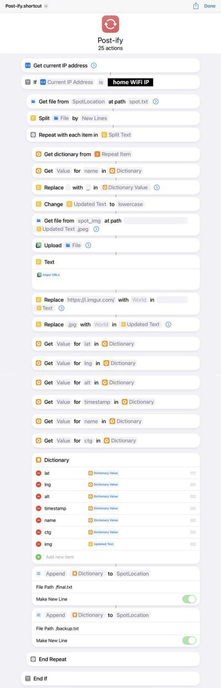

<h1> SpotLocation</h1>
Project to save spot around the world through IOS Shortcut and display them in a web page hosted by a Raspberry Pi 4.

 <ol>
  <li><a href="#saving">Saving</a></li>
  <li><a href="#upload">Upload</a></li>
  <li><a href="#display">Display</a></li>
  <li><a href="#htu">How to use</a></li>
  <li><a href="#licence">Licence</a></li>
</ol> 

<h2 id="saving"> Saving </h2>

    

The spots are locally saved in a file (/spot.txt) in JSON format and the images are locally saved in a folder (/spot_img)

<h2 id="uploading"> Uploding </h2>
<h3 id="postify"> Postify </h3>

    

Postify shortcut upload the images saved in the /spot_img on imgur, replacing the img attribute with the imgur urls and save all the spots in other two files (/final.txt and /backup.txt)

<h3> Post </h3>

    

Post do a POST request to the RaspPi address in order with the JSON with all the spot and then it deletes spot.txt, final.txt and all the image saved in spot_img folder

<h2 id="display"> Display </h2>

<ol>
    <li><a href="#general_view">General view</a></li>
    <li><a href="#popupInfo">Popup info</a></li>
    <li><a href="#categoryList">Category list</a></li>
    <li><a href="#infoBox">Info box</a></li>
    <li><a href="#filters">Filters</a></li>
    <li><a href="#gallery">Gallery</a></li>
    <li><a href="#centerView">Center view</a></li>
</ol>

<h3 id="general_view">General view</h3>

Starting window of the site, it shows a map with all the spot marked by with a category icon.  On the left the control buttons.

<h4 id="categoryIcon">Category icon</h4>
    
        All spots are subdivided in six categories (food, mountain, nature, water, urban, view)  
    

    
    
    
    
    
    

<h3 id="popupInfo">Popup info</h3>
    
    Every time the user clicks on a marker a popup will appear on the marker presse, showing some additional information.
      
    
     
<h3 id="categoryList">Category list</h3>
     
    
        When the list button is pressed a pop up will appear on the left, showing the list of all spots divided by category, in this list you the user can toggle the category in order to hide or show all item in the list by clicking on the category name.
      
    
<h3 id="infoBox">Info box</h3>
     
    
        When the info box button is pressed a pop up will appear on the left, showing some information/statistic of all the database like: the numeber of spots saved for each category and the number of spots saved for each country (the latter maded using <a href="https://www.geonames.org/">GeoNames</a> API).
      
    
<h3 id="filters">Filters</h3>
     
    
        When the filter button is pressed a pop up will appear on the left, showing the list of checkboxes, one for each category. Checking and unchecking a category all the spots of that category will appear or disappear.
      
    
    
<h3 id="gallery">Gallery</h3>
     
    
        When the gallert button is pressed a pop up will appear on the left, showing an images gallery with all the photo uploaded on <a href="https://imgur.com/">imgur.org</a> by the <a href="#postify">ios Shortcut</a>. 
        On the top left there are two more buttons (, ) which toggle the style of the gallery: grid or list.
      
    
    
<h3 id="centerView">Center view</h3>
     
    
        When the gallert center button is pressed the view is gonna zoom in a precize location, in my case Italy.
    

<h2 id="htu"> How to use </h2>
<h4 id="note1">openlayer libraries</h4>
    
        In order to make all work you have to import the library in main.js or download the library of openlayers map on their <a href="https://openlayers.org/">site</a> and move it in /lib folder.  (I tested all project with the 7.4.0 version)
    

<h2 id="licence"> Licence </h2>
<h3>openlayers</h3>
<a href="https://openlayers.org/">https://openlayers.org/</a>  

BSD 2-Clause License

Copyright 2005-present, OpenLayers Contributors All rights reserved.

Redistribution and use in source and binary forms, with or without modification, are permitted provided that the following conditions are met:

   1. Redistributions of source code must retain the above copyright notice, this list of conditions and the following disclaimer.

   2. Redistributions in binary form must reproduce the above copyright notice, this list of conditions and the following disclaimer in the documentation and/or other materials provided with the distribution.

THIS SOFTWARE IS PROVIDED BY THE COPYRIGHT HOLDERS AND CONTRIBUTORS "AS IS" AND ANY EXPRESS OR IMPLIED WARRANTIES, INCLUDING, BUT NOT LIMITED TO, THE IMPLIED WARRANTIES OF MERCHANTABILITY AND FITNESS FOR A PARTICULAR PURPOSE ARE DISCLAIMED. IN NO EVENT SHALL THE COPYRIGHT HOLDER OR CONTRIBUTORS BE LIABLE FOR ANY DIRECT, INDIRECT, INCIDENTAL, SPECIAL, EXEMPLARY, OR CONSEQUENTIAL DAMAGES (INCLUDING, BUT NOT LIMITED TO, PROCUREMENT OF SUBSTITUTE GOODS OR SERVICES; LOSS OF USE, DATA, OR PROFITS; OR BUSINESS INTERRUPTION) HOWEVER CAUSED AND ON ANY THEORY OF LIABILITY, WHETHER IN CONTRACT, STRICT LIABILITY, OR TORT (INCLUDING NEGLIGENCE OR OTHERWISE) ARISING IN ANY WAY OUT OF THE USE OF THIS SOFTWARE, EVEN IF ADVISED OF THE POSSIBILITY OF SUCH DAMAGE.

<h3>GeoNames</h3>
<a href="https://www.geonames.org/">https://www.geonames.org/</a>  

Some data used in this project are from GeoNames.org. For other information consult the license Geonames: <a href="https://creativecommons.org/licenses/by/4.0/">https://creativecommons.org/licenses/by/4.0/</a>
